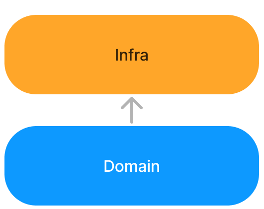
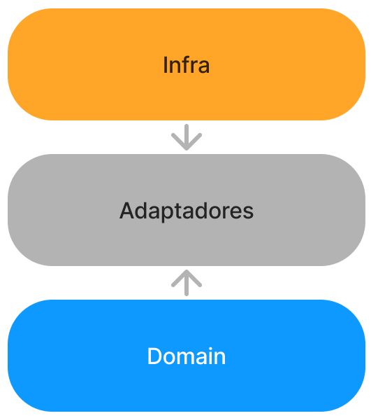

# Typescript: princípios SOLID

## O que aprenderemos hoje?
Neste artigo, você conhecerá um conjunto de 5 princípios (S.O.L.I.D) fundamentais para o desenvolvimento de um sistema de fácil manutenção, extensão, incorporação e principalmente, compreensão.

## Requisitos necessários
Para total aproveitamento do conteúdo a seguir, é indicado que você conheça o paradigma de programação orientado a objetos e tenha noções de herança e polimorfismo.

## Antes de começarmos...
É muito importante entendermos primeiramente o que é Arquitetura de software, para isso, gosto de fazer um paralelo com a Arquitetura Civil, já que está em nosso dia a dia desde sempre e podemos identificar de forma rápida ao entrarmos em um ambiente bem-planejado que este foi projetado por um arquiteto, nos impressionamos com cada canto bem aproveitado, a disposição das luzes e elementos pelas paredes, assim como a conveniência de diversos recursos como pontos de energia e iluminação em cada lugar que podem se apresentar necessários. Ao viver em um ambiente como o descrito, percebemos que acima da beleza, o valor de sua obra está em sua utilidade; O mesmo acontece com sistemas computacionais, se você vai passar meses ou anos trabalhando em um determinado sistema, você vai querer que ele tenha sido em primeiro lugar bem projetado e como um bom desenvolvedor, seu papel é mantê-lo assim, independentemente do quanto ele cresça.

> Como qualquer metáfora, descrever software  por meio das lentes da arquitetura pode esconder tanto quanto pode revelar, pode prometer mais do que entregar e entregar mais do que o prometido.
> O apelo óbvio da arquitetura é a estrutura, que domina os paradigmas e discussões sobre o desenvolvimento de software - Componentes, classes, funções, módulos, camadas e serviços, micro ou macro. No entanto, muitas vezes, é difícil confirmar ou compreender a estrutura bruta de vários sistemas de software - esquemas corporativos ao estilo soviético em vias de se tornarem legado, improváveis torres de equilíbrio se estendendo em direção a nuvem, camadas arqueológicas enterradas em um slide que parece uma imensa bola de lama. Pelo jeito, a estrutura de um software não é tão intuitiva quanto a de um prédio.
> (MARTIN, R.C. Arquitetura limpa: O guia do artesão para a estrutura e design de software. [S.l.]: ALTA BOOKS, 2019.)

Na arquitetura civil existem limitações físicas que impedem os profissionais de realizarem certas ações, porém no mundo virtual os limites podem não ser tão claros, assim como Robert C. Martin descreve no trecho acima. Os paradigmas de programação vêm então com mais uma proposta do que não devemos fazer do que o que devemos fazer, escolher um paradigma é escolher os limites que o mesmo impõe, se você escolher o paradigma orientado a objetos, o SOLID é uma adição muito bem-vinda a esses limites.


# Vamos aos SOLID
O SOLID foi apresentado por Robert C. Martin em um artigo dos anos 2000 com o título "Postulados de Projeto e Padrões de Projeto", mas onde ele realmente brilhou foi em seu livro "Arquitetura Limpa", por isso será citado diversas vezes neste conteúdo.


## SRP (Single Responsibility Principle)
> Um corolário ativo da lei de Conway: A melhor estrutura para um sistema de software deve ser altamente influenciada pela estrutura social da organização que o utiliza, de modo que cada módulo de software tenha uma, e apenas uma, razão para mudar.
> (MARTIN, Arquitetura limpa. página 102)

Você está desenvolvendo um sistema de lembretes para a Apple e se depara com a seguinte classe:

```typescript
class Reminder {
    public content: string;
    public id: string;
    public date: Date;
    ...

    constructor(private readonly db: Database) {}

    ...
    public async getTags() {
        let tokens = this.content.split(" ")
        return tokens.filter(t => t[0] === "#")
    }
    public async store() {
        this.db.create({content: this.content, id: this.id, date: this.date})
    }
}
```
Para olhos mal treinados, pode não ter nada de errado aqui, nossa classe de lembrete tem uma funcionalidade para salvar em um banco de dados e outra para retornar as hashtags do content.
Retornar as tags é uma responsabilidade única e exclusiva dos lembretes, mas salvar um conteúdo em um banco de dados não é.
Aqui temos o caso clássico de que *se existe uma ação disponível a uma entidade, essa entidade deve implementar essa ação*, isso esta completamente *errado*, pois dezenas de outras entidades podem precisar salvar seus conteúdos no banco de dados e se por algum motivo nossa implementação do banco mudar da função CREATE para SET, por exemplo, teríamos de alterar todas essas entidades, então para corrigir isso, vamos ver o exemplo abaixo:
```typescript

class Reminder {
    public content: string;
    public id: string;
    public date: Date;

    ...
    public async getTags() {
        let tokens = this.content.split(" ")
        return tokens.filter(t => t[0] === "#")
    }
}

class Storage {
    constructor(private readonly db: Database) {}

    public async storeReminder(data: Reminder) {
        this.db.create(data)
    }
}
```
Agora temos uma nova classe chamada Storage, ela é a responsável por salvar objetos no banco, caso dezenas de classes precisem utilizar este recurso é a classe Storage quem vai lidar com isso, assim, o único motivo para Storage mudar é se mudarmos a implementação do banco de dados e o único para Reminders mudar é se mudarmos as regras de tags.

Existe uma confusão muito comum quando falamos do princípio da responsabilidade única, que muitos desenvolvedores acreditam que uma classe deve fazer apenas uma única coisa e isso também está completamente errado, uma classe deve ter apenas um motivo para mudar e isso significa que deve atender a uma única regra de um determinado ator (ator é quem interage com o sistema, podendo ser um usuário, administrador, outro sistema, stakeholder ou até mesmo outras classes.)

### Sintomas do descumprimento SRP
#### Duplicação Acidental
Digamos que a Apple te pediu para fazer um sistema de cálculo de horários, onde o RH e o financeiro serão os clientes, então você escreve o seguinte código:
```typescript
class Admin {
    calculateWorkHours() {}
}
class RH extends Admin {}
class Financial extends Admin {}
```
Depois de pronto, o sistema começa a dar problemas, por que o RH considera horas trabalhadas o horário que o funcionário entrou e saiu da empresa, enquanto o financeiro considera apenas o horário que ele ficou no computador, desconsiderando as pausas, se você alterar a classe admin, um dos dois times será afetado. Para resolver esta questão você precisa reimplementar as funções da seguinte forma:
```typescript
class Admin {
    ...
}
class RH extends Admin {
    calculateWorkHours()
}
class Financial extends Admin {
    calculateWorkHours()
}
```
Nesse caso, fizemos o oposto da classe de lembretes, já que o cálculo de horas é de responsabilidade única de cada um dos atores 

#### Fusões
Sabe quando você trabalhou dias em uma determinada funcionalidade para seu sistema e com o trabalho pronto, finalmente abre um pull request para anexá-lo a branch principal, mas recebe aquela mensagem super desagradável de um conflito que o impede? 
Pois é, na maioria dos casos isso acontece quando o SRP não é respeitado, sendo assim existe uma classe que atende a mais de um ator do sistema, e são eles quem definem as tarefas, ou seja, mais de um desenvolvedor pode ser solicitado a realizar alterações/adições nesse módulo, e quando isso acontece, na hora de anexar a atividade, se depara com este conflito.

O Princípio da Responsabilidade Única visa simplesmente reduzir ao máximo a necessidade de alterar uma determinada classe e que alterações em terceiros não reflitam em outras classes.

## OCP (Open-Close Principle)
> Bertrand Meyer popularizou este princípio na década de 1980. Em essência, para que os sistemas de software sejam fáceis de mudar, eles devem ser projetados de modo a permitirem que o comportamento desses sistemas mude pela adição de um novo código em vez da alteração do código existente. (MARTIN, Arquitetura limpa. página 103)

Vamos utilizar a resolução do SRP com a classe Reminder e Storage e adicionando uma nova classe para entendermos melhor esse conceito.
```typescript

// Nova classe
class Note {
    public content: string;
    public id: string;
    public date: Date;

    ...
    public Increment(data: string) {
        this.content += data
    }
}

class Reminder {
    public content: string;
    public id: string;
    public date: Date;

    ...
    public async getTags() {
        let tokens = this.content.split(" ")
        return tokens.filter(t => t[0] === "#")
    }
}

class Storage {
    constructor(private readonly db: Database) {}

    public async storeReminder(data: Reminder) {
        this.db.create(data)
    }

    // Alteração necessária
    public async storeNote(data: Note) {
        this.db.create(data)
    }
}
```

A Apple pediu que você adicionasse uma nova funcionalidade ao sistema de Lembretes, agora os usuários podem criar notas que podem ser incrementadas a qualquer momento, por isso, a mesma possui uma função chamada Increment, assim como Reminder, o conteúdo da classe Note também pode ser armazenado no banco de dados, por isso, criamos mais uma função na classe Storage para fazer tal tarefa.
Aqui criamos uma funcionalidade para nosso sistema (class Notes) e alteramos uma já existente (class Storage), vamos ver o que Martin tem a dizer sobre isso:
> Um artefato de software deve ser aberto para extensão, mas fechado para a modificação. Em outras palavras, o comportamento de um atefato de software deve ser extensível sem isso modificar esse artefato. (MARTIN, Arquitetura limpa. Página 114)
Bom, agora está claro que o problema está na classe Storage, porque toda a vez que incrementarmos nosso sistema para alguma entidade que precise ser armazenada em um banco de dados, vamos precisar alterar o storage, e isso mostra a importância desse princípio, você já deve ter visto ou ouvido falar de sistemas tão grandes e legados, que quanto mais ele cresce, mais os desenvolvedores demoram para implementar novas funcionalidades.
> Evidentemente, essa é a principal razão de estudarmos arquitetura de software. De forma clara, quando extensões simples nos requisitos forçam mudanças massivas no software, os arquitetos desse sistema de software estão em meio a um fracasso espetacular. (MARTIN, Arquitetura limpa. Página 115)
Vamos tentar resolver esse problema:
```typescript
// Nova interface
interface CanStore {
    getContent(): {id: string, content: string, date: Date}
}

class Note implements CanStore {
    public content: string;
    public id: string;
    public date: Date;

    ...
    public Increment(data: string) {
        this.content += data
    }

    public getContent() {
        return {content: this.content, id: this.id, date: this.date}
    }
}

class Reminder implements CanStore {
    public content: string;
    public id: string;
    public date: Date;

    ...
    public async getTags() {
        let tokens = this.content.split(" ")
        return tokens.filter(t => t[0] === "#")
    }

    public getContent() {
        return {content: this.content, id: this.id, date: this.date}
    }
}

class Storage {
    constructor(private readonly db: Database) {}

    public async store(data: CanStore) {
        this.db.create(data.getContent())
    }
}
```
Criamos então uma interface que tem de ser respeitada por qualquer entidade que queira armazenar seus dados no banco (interface CanStore) - em muitas literaturas sobre SOLID você vai se deparar com o autor falando que pedaços de software têm de assumir um contrato, e por contrato no typescript estamos falando de interfaces e assumir o mesmo, estamos nos referindo a implementá-las - que possui uma única função chamada **getContent** com um retorno definido por um conteúdo que é uma **string**, um identificador único que é um **ID** e uma data que é um **Date**, assim qualquer classe que queira ser compatível com **Storage** precisa apenas implementar essa interface e criar a função de  forma que o retorno seja compatível com o esperado, assim, qualquer nova implementação no sistema não precisará alterar a classe **Storage** e pode crescer de maneira simples sem necessidade de alterações em outros módulos.
Vamos ver se isso realmente funciona com mais um exemplo:
A Apple agora pediu para você criar uma funcionalidade onde o usuário pode adicionar links com comentários, então criamos a seguite funcionalidade:

```typescript
interface CanStore {
    getContent(): {id: string, content: string, date: Date}
}

// Nova funcionalidade
class Links implements CanStore {
    public link: string;
    public coment: string;
    ...
    public getContent() {
        return {content: this.coment, id: this.link, date: new Date()}
    }
}

class Note implements CanStore {
    public content: string;
    public id: string;
    public date: Date;

    ...
    public Increment(data: string) {
        this.content += data
    }

    public getContent() {
        return {content: this.content, id: this.id, date: this.date}
    }
}

class Reminder implements CanStore {
    public content: string;
    public id: string;
    public date: Date;

    ...
    public async getTags() {
        let tokens = this.content.split(" ")
        return tokens.filter(t => t[0] === "#")
    }

    public getContent() {
        return {content: this.content, id: this.id, date: this.date}
    }
}

class Storage {
    constructor(private readonly db: Database) {}

    public async store(data: CanStore) {
        this.db.create(data.getContent())
    }
}
```
Percebam que adicionamos apenas a classe **Links** e formatamos o retorno da função **getStorage**, sem precisar mexer em mais nenhum lugar do sistema!

> O OCP é uma das forças motrizes por trás da arquitetura de sistemas. Seu objetivo consiste em fazer com que o sistema seja fácil de estender sem que a mudança cause um alto impacto. Para concretizar esse objetivo, particionamos o sistema em componentes e organizamos esses componentes em uma hierarquia de dependência que proteja os componentes de nível mais alto das mudanças em componentes de nível mais baixo. (MARTIN, Arquitetura limpa. Página 115)

Adicionar a função **getContent** em todas as classes não fere o princípio SRP (de responsábildiade única)?
Não, pois armazenar o dado no banco continua sendo tarefa única e exclusiva da classe **Storage**, mas a formatação dos dados para ir até o **Storage** é de responsábilidade de cada classe que implementa **CanStore**, afinal de contas, cada uma terá um tipo de dado diferente que será traduzido para o formato de **getContent**, como a tradução será feita é responsabilidade de cada classe.

O princípio do OCP visa simplesmente prevenir a criação de sistemas super dependentes onde no inicio é muito simples implementar uma feature, mas com o passar do tempo, por mais simples que seja, novas funcionalidades se tornam uma baita dor de cabeça.

### Sintomas do descumprimento
O principal sintoma do descumprimento do OCP são sistemas de difícil manutenção e evolução, é uma regra tão comumente ignorada que não é raro encontrarmos empresas que sofrem com o orçamento e o tempo para evoluírem seus sistemas, isso cria uma necessidade constante de refatoração.

Um sistema que precisa ter módulos refatorados não é necessariamente um sistema com uma arquitetura ruim, mas se essa necessidade se torna constante, temos uma prova de que um dos principais princípios do SOLID foi ignorado.

Os resultados disso no ponto de vista comercial são terríveis, pois o dinamismo do mercado é alto, sendo assim, a direção do negócio precisa ter um prazo ótimo para acompanhar suas mudanças e aproveitar oportunidades, se o cerne da empresa é a tecnologia, essa carga é passada diretamente a seus desenvolvedores e sem uma boa arquitetura fica cada vez mais inviável realizar as implementações necessárias, até que a empresa colapsa por conta de o orçamento ter de ser constantemente expandido até o momento em que se torna mais caro realizar implementações no sistema do que o retorno que as mesmas trazem.

Para qualquer empresa que dependa de tecnologia, a arquitetura de sistemas é um tópico que pode colocá-la a frente de sua concorrência ou até mesmo acabar com elas, e como dito por Robert C. Martin "O OCP é uma das forças motrizes por trás da arquitetura de sistemas".

## LSP (Liskov Substitution Principle)

> Para cada objeto o1 de tipo S, houver um objeto o2 de tipo T, de modo que, para todos os programas P definidos em termos de T, o comportamento de P não seja modificado quando o1 for substituído por o2, então S é um subtipo de T. (MARTIN, Arquitetura limpa. Página 123)

Essa definição do LSP feita por sua criadora, Barbara Liskov, pode muitas vezes confundir mais do que esclarecer, então vamos tentar repensar da seguinte forma:
"Classes que herdam funcionalidades de outras classes de nível mais baixo, devem conseguir utilizarem as funcionalidades da de nível inferior sem necessariamente conhecer ou alterar seu comportamento."

Para entendermos a definição anterior, vamos olhar novamente nossa classe de contagem de horas:
```typescript
class Admin {
    ...
}
class RH extends Admin {
    calculateWorkHours() {}
}
class Financial extends Admin {
    calculateWorkHours() {}
}
```

As classes de **RH** e **Financial** tem suas próprias funções para calcular as horas de trabalho de cada funcionário e isso está certo pelo princípio de Liskov, mas vamos imaginar que para solucionar aquele problema do cálculo diferir do RH para o Financeiro, o desenvolvedor responsável decide fazer a seguinte implementação

```typescript
class Admin {
    ...
    calculateWorkHours() {}
}
class RH extends Admin {}

class Financial extends Admin {
    calculateWorkHours() {}
}
```

No caso, o método original definido na classe Admin atendia ao RH, mas quando foi necessário que o financeiro fizesse uma conta diferente, ele simplesmente herdou a classe Admin e reescreveu a função de calcular horas, fazendo o famoso *overriding super class method*. Isso fere a definição acima, pois a classe Financial está estendendo Admin e não utilizando o único método útil para ele (calculateWorkHours), então literalmente não faz sentido estender Admin, pois estamos alterando sua lógica.
Voltando a nossa definição, o caso correto de se estender Admin está na classe RH, pois ela não precisa conhecer a lógica usada em calculateWorkHours do Admin, ela simplesmente sabe que o método retorna um número e isso é suficiente para ela, ou seja, **RH é um subtipo correto de Admin**.

Então segundo o princípio de Liskov, sempre está errado sobrescrever um método da classe que você estende?
Não, pois se Financial estivesse utilizando mais de um método de Admin da forma correta e o único caso que ele precise mudar está na função calculateWorkHours, então, tudo bem segundo Liskov, mas isso vai ferir outro princípio (ISP) que veremos a seguir.

### Sintomas do descumprimento
Para entendermos ainda melhor o princípio de Liskov, vamos a um exemplo um pouco mais próximo ao que Robert C. Martin propõe:

Digamos que você criou um gateway de pagamentos sensacional, onde qualquer um que tenha um sistema que necessite receber notificações sobre transações em sua conta realiza o cadastro em seu sistema e adiciona um link para receber as notificações de movimentação em sua conta, como um WebHook.
Um dia, um investidor da sua empresa chamado Alan contrata uma equipe de desenvolvedores para criar um sistema que se integra ao seu. Após finalizada a integração eles alegam que o sistema não funciona e explorando melhor o caso, você percebe que não leram sua documentação e o sistema do cliente espera receber campos na requisição com nomes diferentes do que o seu sistema está programado.

Para ajudar, você decide criar uma classe especial apenas para disparar requisições a esse cliente em específico:
- A classe *Dispatch* que faz as requisições
- Você cria uma classe *DispatchToAlan* que é um subtipo de *Dispatch* porem altera o nome dos campos de envio.
Bom, isso se resolve facilmente com um *if* certo? Sim, se resolve apenas com uma simples condicional, mas imagine que sua empresa comece a atrair cada vez mais investidores e de novo esse problema se repete, como você abriu um precedente com o desenvolvedor anterior, começa a criar cada vez mais subtipos de *Dispatch* para atender as necessidades de novos clientes.

Aqui podemos tirar algumas conclusões, a primeira é que sua documentação deve estar horrível para que ninguém entenda e programe os campos com os nomes corretos para o recebimento, mas pior ainda, é que nenhum dos Subtipos de *Dispatch* que você está criando é válido, pois todos eles precisam alterar a lógica da classe original para atender aos clientes.

Isso fere gravemente o princípio do OCP, pois como esses subtipos de Dispatch alteram sua lógica em algum nível, se Dispatch for alterado por alguma razão, você pode precisar alterar todos esses subtipos, o que também fere o SRP, pois essas classes passam a ter mais de uma razão para mudar (Sendo elas a primeira que é válida, caso o seu cliente mude o tipo de recebimento e a segunda inválida, caso você mude o comportamento da classe original).

> O LSP pode, e deve ser estendido ao nível da arquitetura. Uma simples violação da capacidade de substituição pode contaminar a arquitetura do sistema com uma quantidade significante de mecanismos extras. (MARTIN, Arquitetura limpa. Página 123)

## ISP (Interface Segregation Principle)
> Este princípio orienta que os projetistas de software evitem depender de coisas que não usam. (MARTIN, Arquitetura limpa. Página 103)

Sempre é melhor criarmos várias interfaces para diferentes implementações do que apenas uma generalista.

```typescript
interface Admin {
    payEmployees(): void
    updateInfo(): void
    getLatestPayments(): Payments[]
    calculateWorkHours(): number
}
class RH implements Admin {
    payEmployees() {
        throw new Error("Function not available for this actor");
    }
    updateInfo() {
        // realiza a tarefa
    }
    getLatestPayments() {
        throw new Error("Function not available for this actor");
    }
    calculateWorkHours() {
        // realiza a tarefa
    }

}
class Financial implements Admin {
    payEmployees() {
        // realiza a tarefa
    }
    updateInfo() {
        throw new Error("Function not available for this actor");
    }
    getLatestPayments() {
        // realiza a tarefa
    }
    calculateWorkHours() {
        // realiza a tarefa
    }
}
```

O que era nossa classe Admin se tornou uma interface a ser implementada, e essa interface declara que Administradores podem pagar funcionários, atualizar suas informações, buscar os últimos pagamentos e calcular suas horas de trabalho.
O problema aqui é que nem todos os Administradores podem realizar todas as tarefas, então no caso do RH, que não pode pagar funcionários ou buscar os últimos pagamentos, temos que disparar um erro caso a função seja chamada, o mesmo para o Financeiro que não pode atualizar as informações do profissional.
É sempre muito prejudicial depender de módulos que contenham mais do que você precisa, isso pode ocasionar bugs sérios em seus sistemas por uma falta de atenção de algum desenvolvedor que não sobrescreveu, além de problemas de segurança e muitas vezes ferir principalmente os princípios do OCP e SRP, por que, afinal de contas, se mais classes implementam Admin e você precisa alterar o Admin, vai precisar alterar as classes (que fere o OCP), ter muita coisa embarcada no Admin vai fazer com que ele tenha mais de um motivo para ser alterado (Já que vários atores o implementam e isso fere o SRP).

A solução para isso é a Segregação de interfaces, como diz o próprio nome do princípio:
```typescript
    interface CanPay {
        payEmployees(): void
    }
    interface CanUpdate {
        updateInfo(): void
    }
    interface CanSearchPayments {
        getLatestPayments(): Payments[]
    }
    interface CanCalculate {
        calculateWorkHours(): number
    }

    class RH implements CanUpdate, CanCalculate {
        updateInfo() {
            // realiza a tarefa
        }
        calculateWorkHours() {
            // realiza a tarefa
        }
    }

    class Financial implements CanPay, CanSearchPayments, CanCalculate {
        payEmployees() {
            // realiza a tarefa
        }
        getLatestPayments() {
            // realiza a tarefa
        }
        calculateWorkHours() {
            // realiza a tarefa
        }
    }
```

Observem que dessa forma cada classe implementa apenas o que convém a ela, e além de tornar nosso código muito mais legível e intuitivo, o torna mais seguro, previne erros inesperados e que quebremos os princípios de OCP (não temos de alterar protocolos ou classes a cada nova implementação), SRP (cada classe implementa apenas o que é de sua única responsabilidade), e LSP (por não termos de sobrescrever funcionalidades).

> Depender de algo que contém itens desnecessários pode causar problemas inesperados.

### Sintomas do descumprimento
A dificuldade de compreensão de um sistema é um grave problema, pois o tempo de evolução do mesmo se torna muito maior e a curva de aprendizagem de novos desenvolvedores cresce com a complexidade desnecessária.
Depender de modulos desnecessários abre uma brexa de segurança muito grave, como podemos ver na citação abaixo:
> Considere um arquiteto que está trabalhando em um sistema chamado S, em que deseja incluir o framework F. Agora, suponha que os próprios autores ligaram F a um banco de dados D específico. Então S depende de F que depende de D.
> Agora, suponha que D contenha recursos que F não usa e que, portanto, não são essenciais a S. Qualquer mudança nesses recursos de D pode muito bem forçar a reimplantação de F e, por extensão, a reimplantação de S.
>Pior ainda, uma falha em um dos recursos de D pode causar falhas em F e S. (MARTIN, Arquitetura limpa. Página 132)

## DIP (Dependency Inversion Principle)
> Segundo o princípio da inversão de dependência DIP, os sistemas mais flexíveis são aqueles em que as dependências de código-fonte se referem apenas a abstrações e não a itens concretos (MARTIN, Arquitetura limpa. Página 135)

Acredito que a definição de Martin para este princípio seja a mais direta e compreensível de todas, ainda mais para nós que trabalhamos com Typescript, e dado que já conhecemos todos os outros princípios, este será mais fácil, vamos ver o exemplo a seguir:
```typescript

    class Storage {
        constructor(private readonly seq: Sequelize) {}

        public async store(data: CanStore) {
            this.seq.query(data.getContent())
    }
}
```




</br></br></br>Aqui vemos que Storage é inicializado com Sequelize, que por sua vez é uma implementação concreta de interações com o banco de dados, que não está em nosso controle mudar, ou prevenir que a mesma mude.
Storage está em nossa regra de negócio (Domain), e o Sequelize está em nossa Infraestrutura (Infra), percebam que a Infra está apontando para Domain, e isso significa que nossa regra de negócio depende da nossa infraestrutura, isso é terrível, pois, a Domain é definido pelo cliente do sistema, é nossa regra base, se a tecnologia que usamos influencia nisso, então quer dizer que mudanças nessa tecnologia podem mudar nosso negócio, idealmente é nosso negócio que deve determinar as tecnologias a serem usadas e não depender delas.
O DIP nos ajuda a solucionar esse problema da seguinte forma:</br></br></br>



Veja a codificação da figura acima:

```typescript

    class DatabaseAdapter implements Database {
        constructor(private readonly seq: Sequelize) {}
        async set(data: Data): Promise<void> {
            // insere dados no banco
        }
        async get(id: string): Promise<DbReturn> {
            // busca dado pelo id
        }
    }

    interface Database {
        set(data: Data): Promise<void>
        get(id: string): Promise<DbReturn>
    }

    class Storage {
        constructor(private readonly db: Database) {}

        public async store(data: CanStore) {
            this.db.set(data.getContent())
    }
}
```

Percebam que agora temos um protocolo (Interface Database) para como devemos lidar com o banco de dados em si, e nossa classe **Storage** aponta para este protocolo, a qual é uma abstração, também criamos a classe **DatabaseAdapter** que implementa este protocolo, isso tudo significa que caso seja necessário trocar o ORM que estamos utilizando, quem deve fazer isso é a classe DatabaseAdapter que respeita o contrato definido em **Database**, mas nenhuma alteração será necessária em Storage.

Ah, mas se a tecnologia de banco de dados mudar, vamos precisar alterar a classe DatabaseAdapter, e isso fere o princípio OCP, não?
Não, por conta do SRP, pois a classe DatabaseAdapter só tem uma única razão para mudar, o banco de dados que estamos utilizando.

Extra:
Para sistemas que aderem ao DIP, é muito comum vermos Factories para construir as classes, do tipo:
```typescript
const makeStorage = (): Storage {
    const db = new DatabaseAdapter(Sequelize)
    return new Storage(db)
}
```
E ao ter muitas classes que dependem de vários adaptadores, pode ficar muito chato montar essas factories, por isso recomendo que você de uma olhada no [Inversify](https://inversify.io), existe uma curva de aprendizado para usar a ferramenta, mas com o conhecimento que você adquiriu durante este conteúdo, pode ser uma ótima adição a sua Stack.

### Sintomas do descumprimento
Alterações em modulos não essenciais necessitam de alterações em módulos essenciais.
O que quero dizer é que seu negócio se torna dependente de suas ferramentas, sobre o seu negócio você tem controle, sobre as ferramentas que você utiliza, não, então depender delas é literalmente um tiro no pé.

Finalmente terminamos de ver todos os princípios do SOLID, e agora no final fica claro como os mesmos se complementam, mas para realmente fixarmos esse conhecimento, vamos praticar um pouco.


# Exercícios

1) Um novo departamento é criado dentro da Apple e dois desenvolvedores são encarregados de criar funcionalidades que atendam a este novo departamento. As demandas dependem da integração de um banco de dados não relacional e do sistema de autenticação que já existe, então eles criam uma interface que define as funcionalidades desse novo elemento na infraestrutura, programam uma classe que atenda essa interface, então criam a classe que atende, de fato, o novo departamento, esta,  é inicializada com a classe abstrata do novo banco de dados.
Eles percebem que vão precisar alterar a classe de autenticação para que possam utilizar seus recursos junto a classe do novo departamento.
Os desenvolvedores estão enfrentando este problema por que algum principio do SOLID foi ignorado, qual foi?

- SRP
- OCP
- LSP
- ISP
- DIP
<details>
    <summary>Ver resposta</summary>
    OCP
</details>


</br></br>2) Uma empresa percebe que está gastando muito com uma ferramenta que faz buscas em seu banco de dados não relacional, então decidem mudar para outra mais barata, porém, os desenvolvedores informam que vão precisar reestruturar a regra de negócio do sistema por causa disso, qual princípio do SOLID foi violado nesse caso?

- SRP
- OCP
- LSP
- ISP
- DIP

<details>
    <summary>Ver resposta</summary>
    DIP
</details>

</br></br>3) Um hacker invadiu o sistema da Apple conseguindo acesso a uma conta de RH. Ele fez movimentações financeiras que não deveriam ser permitidas ao RH, isso só foi possivel porque um desenvolvedor extendeu a classe Administrativa que permitia essas operações e não sobrescreveu as funcionalidades de movimentação financeira para o RH, deixando a brecha que resultou nesse prejuizo, qual princípio do SOLID teria prevenido o ocorrido?

- SRP
- OCP
- LSP
- ISP
- DIP 

<details>
    <summary>Ver resposta</summary>
    ISP
</details>

</br></br>4) Você está passando por uma terrível dor de cabeça, pois toda vez que uma nova demanda de funcionalidade é destinada ao sistema em que trabalha é necessário mudar a classe responsável por registrar os logs do sistema, isso acontece por que a classe de Logs não está respeitando qual princípio?

- SRP
- OCP
- LSP
- ISP 
- DIP 

<details>
    <summary>Ver resposta</summary>
    SRP
</details>

</br></br>5) Sobrescrever todas as funcionalidades de uma classe que você está estendendo não faz sentido, mas isso acontece em diversos sistemas onde os arquitetos não fazem um bom trabalho na hora de relacionar suas entidades, para estes arquitetos, qual principio do SOLID está sendo violado?

- SRP
- OCP
- LSP
- ISP 
- DIP 

<details>
    <summary>Ver resposta</summary>
    LSP
</details>

</br></br>
# SOLID na prática

Conhecer os princípios do SOLID é o primeiro passo para se tornar um bom arquiteto de sistemas, mas para o total aproveitamento destes fundamentos, você deve conseguir identificar suas aplicações de forma rápida e intuitiva, para que isso aconteça, precisamos praticar.
Aqui proponho uma linha de raciocínio que pode facilitar muito seu trabalho.

## Defina seus Atores
Como vimos durante o SRP, os atores são as chaves da nossa construção, o sistema é desenvolvido para eles e os módulos de alto nível que desenvolvermos devem ter a propriedade de só serem modificados mediante a necessidade de um e apenas um destes atores.
Ou seja, nunca comece a desenvolver um sistema perguntando o que ele vai fazer, mas sim **quem vai utilizá-lo**

Vamos então imaginar o desenvolvimento de um sistema para um e-commerce.

Quem vai utilizá-lo?
- Consumidor
- Operador
- Gerente

Nesse cenário, quais são as atribuições de cada um destes atores?

#### **Consumidor**
Quer acessar o sistema para olhar catálogos e comprar itens.
#### **Operador**
Insere novos produtos no sistema e pode atualizar seus preços e informações.
#### **Gerente**
Existe para controlar as propriedades do sistema, pode adicionar novos operadores ou removê-los e alterar as taxas globais para compra de produtos.

Dessa forma, já estabelecemos nossas entidades mais primitivas e o que podem fazer em nosso sistema, traduzindo para o código:

```typescript
    interface Customer {
        getProducts(start: number, end: number): Promise<Products[]>
        buy(productId: string): Promise<boolean>
    }

    interface Operator {
        addProduct(product: Product): Promise<boolean>
        updateProduct(product: Product): Promise<boolean>
    }

    interface Manager {
        addOperator(userId: string): Promise<boolean>
        removeOperator(userId: string): Promise<boolean>
        changeFees(fee: number): Promise<boolean>
    }
```

Aqui começamos a rascunhar o sistema e como ele deve se comportar, mas ainda faltam requisitos, principalmente os de caso base, por exemplo, como cadastrar um gerente na plataforma? Já que dependemos dele para cadastrar operadores e os clientes dependem dos operadores para ter produtos a serem visualizados e comprados.

Uma coisa podemos dizer que os 3 atores tem em comum, todos são usuários, que precisam se cadastrar, trocar suas senhas, caso necessário, verificarem seus perfis, etc.
Vamos desenhar uma interface para usuário:

```typescript
    interface User {
        register(name: string, email: string, password: string): Promise<string>
        changePassword(userId: string, newPassword: string): Promise<boolean>
    }
```

Estaria correto dizer que Customer, Operator e Manager são subtipos válidos de User?

Isso quem nos responde é Barbara Liskov com o LSP, pois o comportamento de User não depende de maneira alguma do comportamento de nenhum dos 3 atores, o que significa que os mesmos não precisam sobrescrevê-los e sim, são subtipos válidos.

Agora temos então 4 módulos de sistema que respeitam o SRP, pois para o caso dos 3 atores apenas eles podem alterar seus comportamentos e para o caso do User, o comportamento só seria alterado se e apenas se a regra de usuários geral do sistema fosse alterada.

Ainda falta uma pergunta, se adicionarmos mais um Ator a este sistema, como um Coordenador, por exemplo, algum outro módulo teria de ser alterado para que o mesmo fosse feito? Ou se alterassemos o User, seria necessária uma alteração de seus subtipos?
Não, um Coordenador estenderia o User, e para todos os Atores que até o momento implementam User, não precisam sobrescrevê-lo, então estamos respeitando o OCP até o momento.

Apenas nesse pequeno exercício já resolvemos 3 princípios: SRP, OCP e LSP.

## Entenda suas dependências
Cuidado com essa etapa, entender as dependências de um sistema não é escolher as ferramentas dele, mas sim o que essas ferramentas precisam ter para nos atender.

A dependência mais intuitiva que podemos ver aqui é um lugar para registrarmos nossos dados, então precisamos criar um tipo para definir o que utilizaremos de um banco de dados, vamos analisar ator por ator e entender suas necessidades:
- Customer: Leitura e Escrita (Afinal de contas, a compra tem de ser registrada em algum lugar)
- Operator: Escrita e Atualização
- Manager: Escrita e Atualização

Ou seja, as funcionalidades necessárias de nosso banco são: Leitura, Escrita e Atualização. Percebam que não precisamos deletar dados em nenhum momento com nossas entidades, assim, partir do pré-suposto de que um CRUD é o mínimo necessário para uma implementação de banco de dados está errado.

Vamos escrever nossas interfaces para essa dependência:
```typescript
    interface CanWrite {
        create(data: any): Promise<void>
    }
    interface CanChange {
        update(data: any): Promise<void>
    }
    interface CanRead {
        read(id?: string, startAt?: number, limit?: number): Promise<any[]>
    }
```
Para respeitar o ISP, tivemos de criar um protocolo para cada necessidade, pois o Customer precisa Ler e Escrever, o Operator e o Manager precisam Atualizar e Escrever, ou seja, se tivéssemos unido a função Update e Create em uma mesma interface, o Customer que só precisa Escrever teria a dependência da Atualização também, o que vai contra nosso princípio e já falamos anteriormente sobre os sérios problemas disso.

Nosso sistema também precisa ser exposto de alguma forma, seja como uma biblioteca ou aplicativo, mas aqui vamos escolher uma API, então vamos fazer o mesmo exercício do banco de dados para essa dependência.

- Customer: GET e POST
- Operator: POST e PUT
- Manager: POST e PUT

Viram como caímos no exato mesmo modelo do banco de dados? Vamos criar as interfaces:
```typescript
    interface CanGet {
        get(func: any): Promise<Controller>
    }
    interface CanPost {
        post(func: any): Promise<Controller>
    }
    interface CanPut {
        put(func: any): Promise<Controller>
    }
```
E pronto, temos nossas dependências estabelecidas, respeitando o ISP e finalmente vamos às ferramentas:
## Defina suas ferramentas
Já sabemos o que precisamos de nossas ferramentas, então para o banco de dados, vamos escolher o Sequelize como nosso ORM (Dica: sempre tente tirar o máximo proveito que puder do typescript, escolha ferramentas que tenham tipos declarados ou que possuam alguma lib para tal, como no caso do Firestore (Google) que não possui as tipagens de modelo, mas temos o [firestore-wrapper](https://www.npmjs.com/package/firestore-wrapper) que lhe auxilia em tal tarefa) e o Express como o runtime de nossa aplicação.

A interface dos nossos adaptadores nós já temos, basta agora codificar suas classes com a ferramenta escolhida:
```typescript
    class ReadAdapter implements CanRead {
        constructor (private readonly seq: Sequelize) {}
        async read(id?: string, startAt?: number, limit?: number): Promise<any[]> {
            // lógica da função
        }
    }
```
Como os módulos de nosso sistema estarão apontando para interfaces abstratas que são posteriormente implementadas por adaptadores que serão injetados nos módulos, estamos aqui respeitando o último princípio DIP.

Bom, até aqui acredito que você já tenha entendido a linha de raciocínio para se planejar um sistema com os princípios do SOLID em mente, que tal realmente colocarmos a mão na massa e criar um sistema simples com todas essas implementações e testes para cada um de nossos módulos a fim de garantirmos o comportamento esperado?
Isso vai ficar para o próximo artigo, enquanto isso, vamos praticar mais um pouco.

# Exercícios

</br> 1) Analise o programa definido a seguir:
```typescript

    class Circle {
        constructor(public readonly radius: number) {}
    }

    class Rectangle {
        constructor(public readonly width: number, public readonly height: number) {}
    }

    class CalculateArea {
        public circleCalculator(circle: Circle): number {
            return Math.PI * (circle.radius * circle.radius);
        }

        public rectangleCalculator(rectangle: Rectangle): number {
            return rectangle.width * rectangle.height;
        }
    }

```

Aqui temos um caso clássico de uma classe que calcula a área de diferentes **Formas**, temos o **Círculo** e o **Retângulo**, porém, este programa está violando um princípio, qual é este princípio?

<details>
    <summary>Dica</summary>
    Tente adicionar mais uma forma, como o Triângulo, por exemplo.
</details>

<details>
    <summary>Ver resposta</summary>
    OCP
</details></br></br>

1.1) Escreva um programa que corrija essa falha.

<details>
    <summary>Ver resposta</summary>

    interface Shape {
        calculateArea(): number;
    }

    class Circle implements Shape {
        constructor(public readonly radius: number) {}
        
        public calculateArea() {
            return Math.PI * (this.radius * this.radius);
        }
    }

    class Rectangle implements Shape {
        constructor(public readonly width: number, public readonly height: number) {}
    
        public calculateArea() {
            return this.width * this.height;
        }
    }

    class CalculateArea {
        public calculate(shape: Shape): number {
            return shape.calculateArea();
        }
    }

</details>
</br>

</br>2) Continuando com nosso programa que calcula formas geométricas, vamos replicar um caso definido por Martin sobre um dos princípios, analise o código a seguir:
```typescript

    class Rectangle {
        constructor(public readonly width: number, public readonly height: number) {}
    }

    class Square extends Rectangle {
        
        constructor(public side: number) {
            super(side, side);
        }
    }
```

Qual princípio do SOLID está sendo violado? Por quê?

<details>
    <summary>Dica</summary>
    Square está alterando o comportamento de Rectangle
</details>

<details>
    <summary>Ver resposta</summary>
    LSP, pois a classe Square está estendendo Rectangle, mas os lados de um quadrado devem ter sempre o mesmo valor, enquanto o retangulo pode ter altura e largura indpendentes, tornando-se assim, um subtipo incoerente.
</details>

</br></br> 2.1) Escreva um programa que corrija essa falha.

<details>
    <summary>Ver resposta</summary>

    class Rectangle {
        constructor(public readonly width: number, public readonly height: number) {}
    }

    class Square {
        constructor(public readonly side: number) {}
    }

</details>
</br>3) Considere o programa abaixo:

```typescript
    interface ShapeOperations {
        calculateArea(): number
        countVertex(): number
        calcDiameter(): number
    }

    class Square implements ShapeOperations {
        constructor(public readonly side: number) {}
        calculateArea(): number {
            return this.side * this.side;
        }
        countVertex(): number {
            return 4
        }
        calcDiameter(): number {
            return this.side * Math.sqrt(2);
        }
    }

    class Circle implements ShapeOperations {
        constructor(public readonly radius: number) {}
        calculateArea(): number {
            return Math.PI * (this.radius * this.radius);
        }
        countVertex(): number {
            throw new Error("Circle has no vertex");
        }
        calcDiameter(): number {
            return this.radius * 2;
        }
    }
```

Qual princípio do SOLID está sendo violado? Por quê?</br>
<details>
    <summary>Dica</summary>
    Circle não pode implementar um contador de vértices
</details>
<details>
    <summary>Ver resposta</summary>
    ISP, se o circulo não pode implementar um contador de vértices, ele não deveria estender essa interface

</details>

</br>3.1) Escreva um programa que corrija essa falha.

<details>
    <summary>Ver resposta</summary>

    interface HasArea {
        calculateArea(): number
    }

    interface HasVertex {
        countVertex(): number
    }

    interface HasDiameter {
        calcDiameter(): number
    }

    class Square implements HasArea, HasVertex, HasDiameter {
        constructor(public readonly side: number) {}
        calculateArea(): number {
            return this.side * this.side;
        }
        countVertex(): number {
            return 4
        }
        calcDiameter(): number {
            return this.side * Math.sqrt(2);
        }
    }

    class Circle implements HasArea, HasDiameter {
        constructor(public readonly radius: number) {}
        calculateArea(): number {
            return Math.PI * (this.radius * this.radius);
        }

        calcDiameter(): number {
            return this.radius * 2;
        }
    }

</details>
</br></br>

# Próximos passos

- Leia o livro base para a construção desse conteúdo: Arquitetura Limpa por Robert C. Martin.

Com os conhecimento adquiridos nesse conteúdo, o livro do famoso Uncle Bob será muito mais palatável, mas não substitui a leitura do mesmo, que vai te apresentar outros exemplos com abordagens diferentes.

- Tenha meios de planejar seus sistemas fora a escrita de interfaces.

UML é uma ferramenta muito poderosa para te ajudar no processo de planejamento, nesse conteúdo não falamos sobre isso, pois o foco aqui é o SOLID com Typescript, porém os diagramas são uma forma muito mais eficiente de entender como e o que será construido do que sair definindo interfaces, eles nos ajudam principalmente a entendermos como serão as relações entre nossas classes e entidades, quais comportamentos são esperados de cada uma e principalmente, nos ajudam a identificar os erros e incoerências dos programas antes de colocarmos a mão na massa. Um bom programador passa mais tempo no papel que no código.

Existem muitos artigos sobre o tema, como [O do professor Marcelo Linder](http://www.univasf.edu.br/~marcelo.linder/arquivos_pooC4/aulas/aula4.pdf), que de uma forma simples te apresenta os conceitos básicos, mas se você quiser um conteúdo mais completo, minha recomendação é o livro [UML 2 - Uma Abordagem Prática](https://www.google.com.br/books/edition/UML_2_Uma_Abordagem_Prática/mJxMDwAAQBAJ?hl=pt-BR&gbpv=1&printsec=frontcover).

- Estude DDD.

Neste conteúdo eu propus uma linha de raciocionio para você começar a formular seus sistemas, porém, é importante que você entenda sobre os processos mais aceitos de design de software.
Proposto por Eric Evans em seu livro [Domain-Driven Design: Atacando as complexidades no coração do software](https://www.amazon.com.br/Domain-Driven-Design-Eric-Evans/dp/8550800651/ref=sr_1_1?__mk_pt_BR=ÅMÅŽÕÑ&crid=1X1113FEZIAG8&keywords=Domain-Driven+Design%3A+Atacando+as+complexidades+no+coração+do+software&qid=1666016237&qu=eyJxc2MiOiIwLjUxIiwicXNhIjoiMC4wMCIsInFzcCI6IjAuMDAifQ%3D%3D&sprefix=domain-driven+design+atacando+as+complexidades+no+coração+do+software%2Caps%2C174&sr=8-1) em 2003, o DDD é fundamental para que engenheiros de software consigam se comunicar bem com os experts do negócio e traduzir as necessidades de maneira efetiva para o sistema.
O livro é minha principal recomendação, mas caso queira uma introdução um pouco mais direta, o [artigo da FullCycle sobre o assunto](https://fullcycle.com.br/domain-driven-design/) é bem interessante.

- Saiba trabalhar em equipe.

Depois de se tornar um especialista em arquitetura de sistemas, precisa trabalhar com outros desenvolvedores de maneira eficiente, para que depois de tudo bem planejado, cada um ataque um domínio do sistema a ser desenvolvido, e para que vocês não caiam no famoso ditado: O que um desenvolvedor faz em uma semana, dois fazem em duas.

Com um sistema bem desenhado e planejado, esse trabalho se torna algo muito fácil e para ajudar ainda mais, recomendo que estude sobre [GitFlow](https://blog.betrybe.com/git/git-flow/) e utilize sempre o [Conventional Commits](https://www.conventionalcommits.org/en/v1.0.0/) para ajudar seus colegas a entenderem o que você está fazendo.